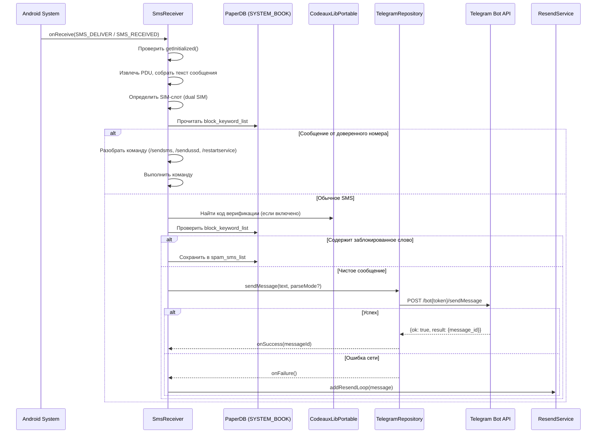
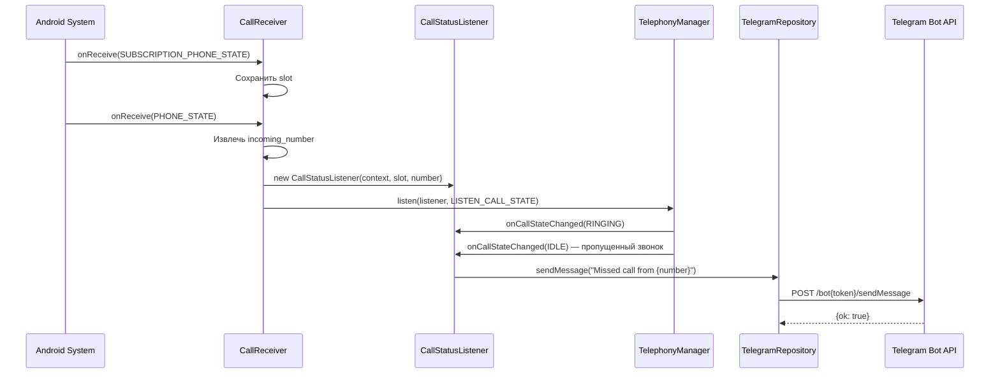
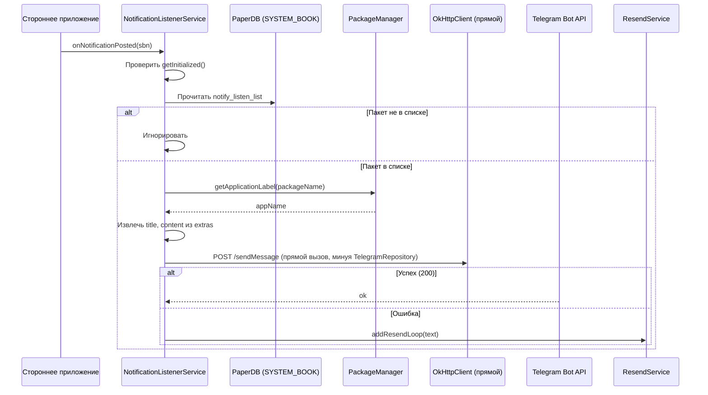
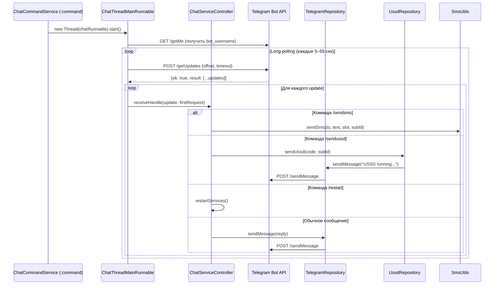
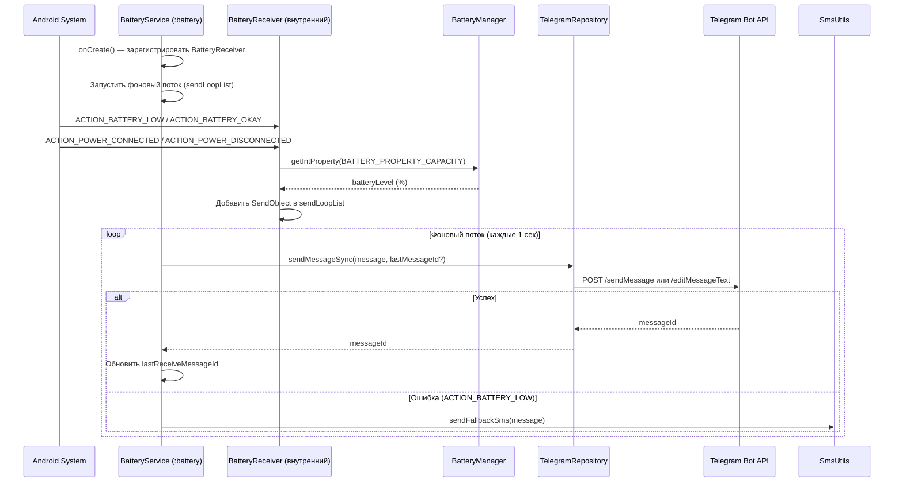

# Design Document: project-analysis-documentation

## Overview

Данный документ описывает технический дизайн плана анализа и документирования Android-проекта **telegram-sms** — приложения на Kotlin, которое пересылает SMS, уведомления о пропущенных звонках и изменениях заряда батареи в Telegram через Bot API.

**Цель:** создать структурированную документацию (`docs/architecture.md`), которая станет единой точкой входа для понимания системы при планировании изменений.

**Проект:** ~50 Kotlin-файлов, 12 пакетов, Android API 22+, несколько процессов (`:command`, `:battery`).

**Результат:** файл `docs/architecture.md` в корне проекта, охватывающий архитектуру, компоненты, потоки данных, слой данных, зависимости, модели и конфигурацию сборки.

---

## Architecture

### Структура создаваемых документов

```
telegram-sms/
└── docs/
    └── architecture.md          # Единый итоговый документ архитектуры
```

Вся документация сосредоточена в одном файле `docs/architecture.md`. Это сознательное решение: проект небольшой (~50 файлов), и разбиение на множество файлов создаст лишнюю навигационную нагрузку.

### Структура итогового документа `docs/architecture.md`

```
1. Обзор системы
2. Архитектурные слои
3. Android-компоненты
   3.1 BroadcastReceivers
   3.2 Services
   3.3 Activities
4. Потоки данных (с Mermaid-диаграммами)
   4.1 Входящий SMS
   4.2 Входящий звонок
   4.3 Уведомления приложений
   4.4 Команды из Telegram
   4.5 Мониторинг батареи
5. Слой данных
   5.1 PrefsRepository / SharedPrefsRepository
   5.2 LogRepository / LogRepositoryImpl
   5.3 TelegramRepository
   5.4 UssdRepository
   5.5 PaperDB (PaperUtils)
   5.6 Миграция данных
6. Модели данных
7. Внешние зависимости
8. Конфигурация сборки и CI/CD
9. Вопросы безопасности
10. Известные проблемы и технический долг
11. Рекомендации по изменениям
```

### Архитектурные слои приложения

На основе анализа кода выявлены следующие слои:

| Слой | Пакеты | Описание |
|------|--------|----------|
| **UI** | `mainScreen`, `logScreen`, `spamListScreen`, `notificationScreen`, `qrCodeScreen`, `scannerScreen` | Activities, ViewModels, навигация |
| **Domain** | `services`, `receivers`, `services/chat` | Бизнес-логика обработки событий |
| **Data** | `common/data` | Репозитории, абстракции хранилищ |
| **Infrastructure** | `utils`, `model`, `migration` | Сетевые утилиты, модели, миграции |

Паттерны: **MVVM** (Activities + ViewModels), **Repository** (интерфейсы в `common/data`), **Service Locator** (ручной DI через `TelegramSmsApp`).

### Многопроцессная архитектура

```
Основной процесс (main)
├── MainActivity, LogcatActivity, SpamListActivity, ...
├── SmsReceiver, CallReceiver, WapReceiver, BootReceiver
├── NotificationListenerService
└── ResendService

Процесс :command
└── ChatCommandService (long-polling Telegram Bot API)

Процесс :battery
└── BatteryService (мониторинг заряда)
```

Причина изоляции: `ChatCommandService` держит постоянное сетевое соединение (long-polling) и WakeLock/WifiLock — изоляция предотвращает влияние на основной процесс. `BatteryService` изолирован из-за специфики `RESPOND_VIA_MESSAGE` permission.

---

## Components and Interfaces

### BroadcastReceivers

| Компонент | Intent-действия | Процесс | Разрешения |
|-----------|----------------|---------|------------|
| `SmsReceiver` | `SMS_DELIVER`, `SMS_RECEIVED` | main | `RECEIVE_SMS`, `READ_SMS` |
| `CallReceiver` | `PHONE_STATE`, `SUBSCRIPTION_PHONE_STATE` | main | `READ_PHONE_STATE`, `READ_CALL_LOG` |
| `WapReceiver` | `WAP_PUSH_DELIVER` | main | `BROADCAST_WAP_PUSH` |
| `BootReceiver` | `BOOT_COMPLETED`, `MY_PACKAGE_REPLACED` | main | `RECEIVE_BOOT_COMPLETED` |
| `SmsSendReceiver` | результат отправки SMS | main | `SEND_SMS` |

### Services

| Компонент | Тип | Процесс | foregroundServiceType | Назначение |
|-----------|-----|---------|----------------------|------------|
| `ChatCommandService` | Started, Foreground | `:command` | `shortService` | Long-polling Telegram Bot API, выполнение команд |
| `BatteryService` | Started, Foreground | `:battery` | `shortService` | Мониторинг заряда и зарядки |
| `NotificationListenerService` | Bound (system) | main | `shortService` | Перехват уведомлений приложений |
| `ResendService` | Started, Foreground | main | `shortService` | Повторная отправка неудавшихся сообщений |

### Activities

| Компонент | ViewModel | Назначение |
|-----------|-----------|------------|
| `MainActivity` | `MainViewModel` + `SettingsViewModelDelegate` | Настройка бота, управление сервисами |
| `LogcatActivity` | `LogViewModel` | Просмотр логов приложения |
| `SpamListActivity` | — | Управление списком блокировки SMS |
| `NotifyAppsListActivity` | — | Выбор приложений для перехвата уведомлений |
| `QrCodeShowActivity` | — | Отображение QR-кода конфигурации |
| `ScannerActivity` | — | Сканирование QR-кода для импорта настроек |

### Dependency Graph (TelegramSmsApp как Service Locator)

```
TelegramSmsApp
├── StringsProvider
├── LogRepository (LogRepositoryImpl)
├── Logger (LoggerImpl)
├── PrefsRepository (SharedPrefsRepository)
├── TelegramRepository ← PrefsRepository, LogRepository
└── UssdRepository ← LogRepository, TelegramRepository
```

Все зависимости создаются лениво (`by lazy`) в `TelegramSmsApp`. Компоненты получают их через `context.app()`.

---

## Data Models

### Settings

```kotlin
data class Settings(
    val isDnsOverHttp: Boolean,      // DNS-over-HTTPS (Cloudflare)
    val isPrivacyMode: Boolean,      // Режим приватности
    val isChatCommand: Boolean,      // Включить команды из чата
    val isFallbackSms: Boolean,      // Fallback через SMS при сбое сети
    val isChargerStatus: Boolean,    // Уведомлять о подключении зарядки
    val isBatteryMonitoring: Boolean,// Мониторинг заряда батареи
    val isDisplayDualSim: Boolean,   // Показывать имя SIM-карты
    val isVerificationCode: Boolean, // Выделять коды верификации
    val chatId: String,              // ID чата Telegram
    val botToken: String,            // Токен бота Telegram
    val trustedPhoneNumber: String,  // Доверенный номер для команд по SMS
)
```

### RequestMessage (Telegram Bot API sendMessage/editMessageText)

```kotlin
class RequestMessage {
    val disable_web_page_preview = true
    var message_id: Long = 0
    var parse_mode: String? = null   // "html" для кодов верификации
    var chat_id: String? = null
    var text: String? = null
    var reply_markup: KeyboardMarkup? = null
}
```

### ConfigurationQrCodeDTO (QR-код конфигурации)

```kotlin
class ConfigurationQrCodeDTO(
    val bot_token: String?,
    val chat_id: String?,
    val trusted_phone_number: String?,
    val fallback_sms: Boolean,
    val chat_command: Boolean,
    val battery_monitoring_switch: Boolean,
    val charger_status: Boolean,
    val verification_code: Boolean,
    val privacy_mode: Boolean,
)
```

QR-код содержит JSON-сериализацию этого объекта. Генерируется на `qrcode.telegram-sms.com` или в приложении через `QrCodeShowActivity`.

### ProxyConfigV2 (хранится в PaperDB, `system_config/proxy_config`)

```kotlin
class ProxyConfigV2 {
    var port = 1080
    var host = ""
    var username = ""
    var password = ""
    var enable = false
    var dns_over_socks5 = true  // DNS через SOCKS5 прокси
}
```

### Миграция: ProxyConfigV1 → ProxyConfigV2

`UpdateVersion1` выполняет миграцию при обновлении приложения: читает `ProxyConfigV1` из PaperDB и записывает `ProxyConfigV2` с добавленным полем `dns_over_socks5 = true`.

### PaperDB — схема хранения

| Book | Ключ | Тип | Назначение |
|------|------|-----|------------|
| `default` | `spam_sms_list` | `ArrayList<String>` | Список заблокированных SMS (макс. 5) |
| `default` | `bot_username` | `String` | Username бота (кэш) |
| `default` | `message_list` | структура | Список отправленных сообщений для reply |
| `system_config` | `proxy_config` | `ProxyConfigV2` | Конфигурация SOCKS5-прокси |
| `system_config` | `notify_listen_list` | `List<String>` | Пакеты приложений для перехвата уведомлений |
| `system_config` | `block_keyword_list` | `ArrayList<String>` | Ключевые слова для блокировки SMS |
| `send_temp` | — | — | Временное хранилище для повторной отправки |

---

## Data Flow Diagrams

### 4.1 Поток обработки входящего SMS



### 4.2 Поток обработки входящего звонка



### 4.3 Поток обработки уведомлений приложений



> ⚠️ **Технический долг:** `NotificationListenerService` напрямую использует `OkHttpClient` вместо `TelegramRepository`, нарушая архитектурные слои.

### 4.4 Поток обработки команд из Telegram (long-polling)



### 4.5 Поток мониторинга батареи



---

## Correctness Properties

Данная фича представляет собой задачу документирования существующего кода, а не разработку нового функционального кода. Все acceptance criteria описывают содержимое создаваемых документов, а не поведение программного кода.

**PBT не применим** по следующим причинам:
- Нет функций с входными данными, поведение которых варьируется
- Нет инвариантов, которые можно проверить через генерацию случайных входных данных
- Нет round-trip свойств (сериализация/десериализация не является частью этой фичи)
- Результат — статические документы, а не вычислительные функции

Вместо PBT используются **checklist-проверки** (example-based): наличие обязательных разделов в `docs/architecture.md`, наличие Mermaid-диаграмм для каждого потока данных, наличие описания каждого компонента.

### Property 1: Полнота итогового документа архитектуры

**Validates: Requirements 8.1, 8.2, 8.3, 8.4, 8.5, 8.6**

Файл `docs/architecture.md` SHALL содержать все 11 обязательных разделов: обзор системы, архитектурные слои, BroadcastReceivers, Services, Activities, потоки данных (5 диаграмм), слой данных, модели данных, зависимости, конфигурация сборки, вопросы безопасности, технический долг и рекомендации.

**Проверка:** подсчёт заголовков второго уровня (`##`) в `docs/architecture.md` должен быть ≥ 11.

### Property 2: Покрытие компонентов

**Validates: Requirements 2.1, 2.2, 2.3, 2.4**

Каждый Android-компонент, объявленный в `AndroidManifest.xml`, SHALL быть задокументирован в `docs/architecture.md` с указанием назначения, разрешений и процесса выполнения.

**Проверка:** для каждого имени класса из `<receiver>`, `<service>`, `<activity>` в манифесте — соответствующий раздел присутствует в документе.

### Property 3: Наличие диаграмм потоков данных

**Validates: Requirements 3.1, 3.2, 3.3, 3.4, 3.5, 8.2**

Для каждого из 5 основных сценариев (SMS, звонок, уведомления, команды Telegram, батарея) SHALL присутствовать Mermaid-диаграмма в `docs/architecture.md`.

**Проверка:** количество блоков ` ```mermaid ` в документе ≥ 5.

---

## Error Handling

### Методология фиксации проблем

В ходе анализа выявленные проблемы фиксируются в разделах документа:

**Технический долг** — нарушения принципов разделения ответственности:
- `NotificationListenerService` напрямую использует `NetworkUtils` и `OkHttpClient` вместо `TelegramRepository` — нарушение слоёв
- `BatteryService` напрямую строит HTTP-запросы вместо использования `TelegramRepository`
- `TODO` в коде: `TelegramSmsApp` содержит комментарий `// TODO move dependencies to some DI`
- `TODO` в `UssdRepository.sendUssd` — незавершённая логика
- `BatteryReceiver.onReceive` вызывает `Process.killProcess` с комментарием `// TODO why?`

**Вопросы безопасности** — проблемы, требующие отдельного раздела:
- `botToken` и `chatId` хранятся в `SharedPreferences` в открытом виде
- `botToken` передаётся в URL запроса (`https://api.telegram.org/bot{TOKEN}/...`) — попадает в логи
- OkHttp версии `5.0.0-alpha.2` — нестабильная версия в продакшн-коде
- `StrictMode.permitAll()` при включении прокси — обход политики потоков

**Риски зависимостей:**
- `okhttp3:okhttp:5.0.0-alpha.2` — alpha-версия
- `okhttp3:okhttp-dnsoverhttps:5.0.0-alpha.2` — alpha-версия

---

## Testing Strategy

Данная фича — задача документирования, а не разработки кода. Тестирование сводится к верификации полноты и корректности создаваемых документов.

### Подход к верификации

**Checklist-проверки** (выполняются вручную после создания `docs/architecture.md`):

1. **Структурная полнота** — все 11 разделов присутствуют в документе
2. **Покрытие компонентов** — каждый из 8 receivers/services/activities задокументирован
3. **Покрытие потоков** — 5 Mermaid-диаграмм присутствуют (SMS, звонок, уведомления, команды, батарея)
4. **Покрытие репозиториев** — все 4 репозитория описаны с ключами/методами
5. **Покрытие моделей** — все 9 моделей из пакета `model` задокументированы
6. **Таблица зависимостей** — все зависимости из `build.gradle` включены
7. **Навигация** — каждый раздел содержит ссылки на конкретные файлы проекта
8. **Безопасность** — раздел «Вопросы безопасности» присутствует и содержит выявленные проблемы

### Инструменты анализа кода

| Задача | Инструмент/подход |
|--------|------------------|
| Изучение структуры пакетов | `list_directory` рекурсивно |
| Чтение исходного кода | `read_file`, `read_files` |
| Поиск использований компонентов | `grep_search` по имени класса |
| Анализ зависимостей | `read_file app/build.gradle` |
| Анализ манифеста | `read_file AndroidManifest.xml` |
| Анализ CI/CD | `read_file .github/workflows/android.yml` |
| Поиск TODO/FIXME | `grep_search "TODO\|FIXME"` |
| Поиск прямых HTTP-вызовов | `grep_search "OkHttpClient\|NetworkUtils"` |

### Методология анализа каждого аспекта

**Архитектура:** читать `TelegramSmsApp.kt` (DI-граф), `AndroidManifest.xml` (компоненты и процессы), структуру пакетов.

**Компоненты:** для каждого receiver/service/activity — читать исходный файл, извлекать: intent-фильтры, используемые репозитории, разрешения, процесс выполнения.

**Потоки данных:** трассировать от точки входа (receiver/service) через утилиты до `TelegramRepository.sendMessage`. Фиксировать трансформации данных и точки ошибок.

**Слой данных:** читать интерфейсы (`PrefsRepository`, `LogRepository`) и реализации (`SharedPrefsRepository`, `LogRepositoryImpl`). Извлекать все ключи SharedPreferences и схему PaperDB.

**Зависимости:** читать `app/build.gradle`, для каждой зависимости — найти места использования через `grep_search`.

**Модели:** читать все файлы в пакете `model/`, документировать поля и места использования.

**Сборка:** читать `build.gradle`, `android.yml`, `network_security_config.xml`.
